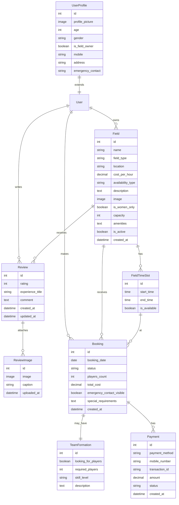
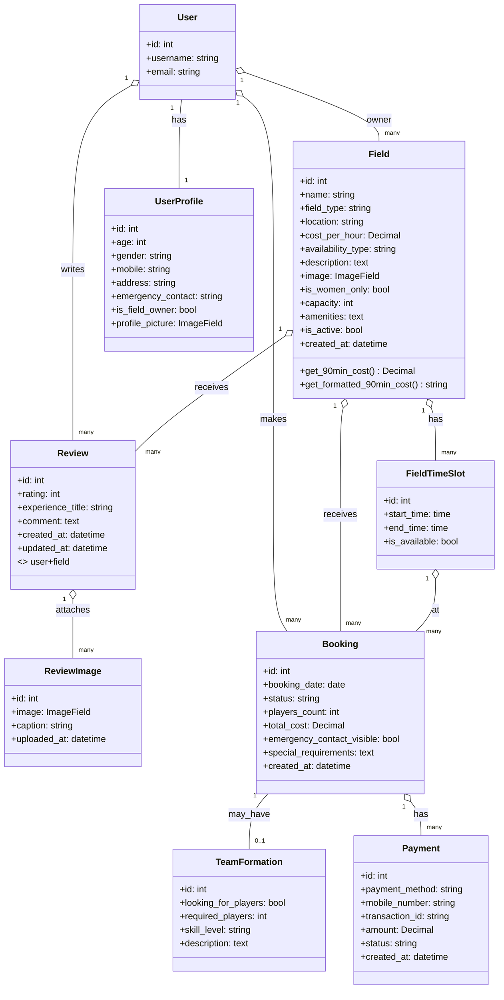

# TurfBooking Platform
Discover, book, and manage sports fields with a polished Django application. Designed for coursework and real users: players find fields and book 90‑minute slots; field owners manage inventory, time slots, and pricing. Includes user profiles, reviews with images, team formation, and a simple mock mobile payment flow.

<p align="left">
  <a href="https://www.python.org/"></a>
  <a href="https://www.djangoproject.com/"></a>
  
  
</p>

---

## Table of Contents
- [Overview](#overview)
- [Key Features](#key-features)
- [Architecture](#architecture)
- [Project At a Glance (Rubric Mapping)](#project-at-a-glance-rubric-mapping)
- [Data Model (ER)](#data-model-er)
- [Class Diagram](#class-diagram)
- [Screens and UX](#screens-and-ux)
- [Getting Started](#getting-started)
  - [Prerequisites](#prerequisites)
  - [Local Setup](#local-setup)
  - [Create Admin and Sample Data](#create-admin-and-sample-data)
- [Usage Walkthrough](#usage-walkthrough)
- [Payments (Mock Gateway)](#payments-mock-gateway)
- [Configuration](#configuration)
- [Folder Structure](#folder-structure)
- [Troubleshooting](#troubleshooting)
- [FAQ (Professor Quick Check)](#faq-professor-quick-check)
- [Contributing](#contributing)
- [License](#license)

---

## Overview
TurfBooking is a three‑app Django project:
- accounts: profiles, authentication pages, password recovery/reset, user dashboard.
- fields: field catalogue, CRUD for owners, time slots, reviews with images, advanced search.
- bookings: booking flow, team formation and join requests, mock payments, booking management.

The UI is powered by Bootstrap 5 with modern styles and interactive components written in vanilla JS.

---

## Key Features
Player-focused:
- Browse, search, and filter fields (type, availability, location, price, capacity, date/time availability).
- View standard 90‑minute slots and next‑7‑day availability.
- Book fields up to 7 days ahead with special requirements.
- Team Formation: mark a booking as “looking for players”; others can request to join.
- Reviews and “experience” posts with up to 5 images.

Field owners:
- Profile flag “I am a field owner” unlocks a dashboard.
- Add/edit/delete fields with images, pricing, capacity, amenities.
- Auto‑generate 11 daily 90‑minute slots (6:00–22:30).
- Manage fields and time slots.

General:
- Clean Bootstrap UI, responsive layouts, animated feedback.
- Forgot password and reset flows with strength meter and validation.
- Mock mobile payments (bKash, Nagad, Upay) with server‑side validation and transaction IDs.

---

## Architecture
- Django 4.2 MVC with template rendering.
- SQLite for development; configurable for PostgreSQL/MySQL in production.
- Media storage for images (fields, review images, profile pictures).
- Settings include sane defaults for local dev and can be hardened for prod.

---

## Project At a Glance (Rubric Mapping)
| Components            | Required | This Project | Summary                                                                                           |
|-----------------------|----------|--------------|---------------------------------------------------------------------------------------------------|
| Number of Apps        | 3        | 3            | accounts, fields, bookings                                                                        |
| Number of Classes     | 7        | 8–9          | Core: Field, FieldTimeSlot, Review, ReviewImage, UserProfile, Booking, TeamFormation, Payment (+JoinRequest if modeled) |
| Number of Foreign Keys| 2        | 5+ (fields app), 12+ (project‑wide) | Field.owner; FieldTimeSlot.field; Review.user; Review.field; ReviewImage.review; and Booking/TeamFormation/Payment relations |
| Use of Media          | 2        | 3            | Field.image; ReviewImage.image; UserProfile.profile_picture                                       |

Note: “JoinRequest” is implied by templates (manage_join_requests.html). If your DB model exists, class count = 9.

---

## Data Model (ER)
Mermaid diagram renders on GitHub. It reflects the code in fields plus the implied bookings flow.



---

## Class Diagram
This class diagram matches the ER model and surfaces method names used in the code.



---

## Screens and UX
- Modern Bootstrap 5 UI, responsive layouts, and interaction hints (progress, badges, hover effects).
- Key pages:
  - Home, Browse Fields, Field Detail (availability + reviews),
  - Add/Edit Field (owner), Time Slots overview,
  - Booking form with team formation, Payment pages,
  - My Bookings, Booking Detail, Manage Join Requests,
  - Auth: Register, Login, Forgot/Reset Password,
  - Profile page with editable user and profile details and avatar preview.

Add screenshots to docs/images and link here:
- Browse Fields
- Field Detail (Availability + Reviews)
- Booking + Payment Success
- Profile + Owner Dashboard

---

## Getting Started

### Prerequisites
- Python 3.10+ (3.11 recommended)
- pip, virtualenv (optional)

### Local Setup
```bash
git clone https://github.com/ENiGMA-101/Arena-Finder-book-my-field-.git
cd Arena-Finder-book-my-field-

python -m venv .venv
# Windows: .venv\Scripts\activate
# macOS/Linux:
source .venv/bin/activate

pip install -r requirements.txt

# Apply migrations and run
python manage.py migrate
python manage.py runserver
```
Visit http://127.0.0.1:8000/

### Create Admin and Sample Data
```bash
python manage.py createsuperuser
```

Create default 90‑minute slots for existing fields (if needed):
```bash
python manage.py create_default_slots
```

Mark a user as field owner:
```bash
python manage.py shell
>>> from django.contrib.auth.models import User
>>> from accounts.models import UserProfile
>>> u = User.objects.get(username="your_username")
>>> profile, _ = UserProfile.objects.get_or_create(user=u, defaults={"age":18,"gender":"Male"})
>>> profile.is_field_owner = True
>>> profile.save()
```

---

## Usage Walkthrough
1. Register and sign in.
2. Edit profile; optionally mark “I am a field owner.”
3. As owner: add a field (name, type, location, cost, image). Default time slots are auto‑created.
4. As player: browse fields, preview available slots by date, book a slot (with special requirements if any).
5. For paid fields, complete the payment (mock gateway) to confirm the booking.
6. Optionally form a team; others can send join requests. Manage requests from your booking page.
7. After playing, leave a review (with up to 5 images).

---

## Payments (Mock Gateway)
Location: bookings/payment_service.py (SimplePaymentGateway)
- Methods: bKash, Nagad, Upay.
- Validates BD mobile format (11 digits, starts with 01) and 4‑digit PIN.
- Generates a transaction ID, creates a Payment record, and sets Booking to Confirmed.
- For production, replace with a proper provider SDK/webhook integration.

---

## Configuration
Key options in newProject/settings.py:
- Static/Media:
  - `STATIC_URL = '/static/'`, `STATICFILES_DIRS = [BASE_DIR / "static"]`
  - `MEDIA_URL = '/media/'`, `MEDIA_ROOT = BASE_DIR / 'media'`
- Email (dev):
  - `EMAIL_BACKEND = 'django.core.mail.backends.console.EmailBackend'`
- Auth redirects:
  - `LOGIN_URL = '/accounts/login/'`, `LOGIN_REDIRECT_URL = '/'`
- Booking settings (90‑minute slots, 7‑day window, etc.) via `TURF_BOOKING_SETTINGS` dict.
- Time zone: `Asia/Dhaka`.

---

## Folder Structure
```
newProject/
├─ accounts/               # profiles, auth pages
├─ fields/                 # fields, slots, reviews, search
│  ├─ models.py            # Field, FieldTimeSlot, Review, ReviewImage
│  ├─ views.py             # Search, detail, CRUD, reviews
│  ├─ forms.py             # FieldForm, ReviewForm, ReviewImageForm
│  ├─ admin.py
│  └─ management/commands/create_default_slots.py
├─ bookings/               # booking flow, team formation, payment pages
├─ templates/              # base + app templates (pages in this repo)
├─ static/                 # css/js/assets (style.css, profile.css)
├─ media/                  # user-uploaded images (created at runtime)
├─ newProject/             # settings, urls, asgi/wsgi
├─ manage.py
└─ requirements.txt
```

---

## Troubleshooting
- Media not showing:
  - Ensure `DEBUG=True` in dev, `MEDIA_URL` and `MEDIA_ROOT` are set, and URL patterns serve media (urls.py handles this in DEBUG).
- Time slots missing:
  - Field creation auto‑generates slots. Otherwise run `python manage.py create_default_slots`.
- Cannot add field:
  - Your profile might not be marked as `is_field_owner`.
- Review blocked:
  - You must have a booking for the field (Confirmed/Completed) to review.
- Mermaid diagram not rendering:
  - Keep attributes as simple words; relationships go on their own lines (see examples above).

---

## FAQ (Professor Quick Check)
1) How many apps and what are they?
- Three: accounts, fields, bookings.

2) Where do you use ForeignKeys and Media?
- ForeignKeys (examples): Field.owner → User; FieldTimeSlot.field → Field; Review.user → User; Review.field → Field; ReviewImage.review → Review; Booking.user/field/time_slot; TeamFormation.booking; Payment.booking; UserProfile.user.
- Media/ImageFields: Field.image, ReviewImage.image, UserProfile.profile_picture.

3) What makes this production‑ready?
- Clear separation of apps, configurable settings, media handling, auth flows, Bootstrap 5 UI, and extensible payment boundary to swap in a real gateway.

---

## Contributing
Contributions are welcome:
1. Fork the repo
2. Create a feature branch: `git checkout -b feat/awesome`
3. Commit: `git commit -m "feat: awesome"`
4. Push: `git push origin feat/awesome`
5. Open a Pull Request

---

## License
This project is licensed under the MIT license. Add a LICENSE file if your course requires explicit inclusion.

---
